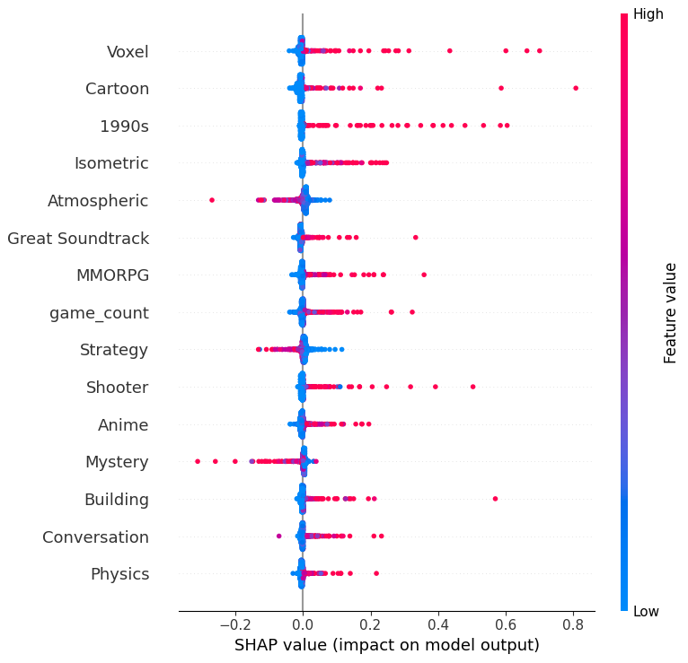
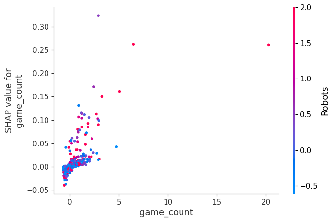

# Feature Importance of a Multi-Layer Perceptron Applied to Elden Ring Reviews and User Gaming History

A machine learning project that uses a Multi-Layer Perceptron (MLP) to predict negative reviews of *Elden Ring* based on users' gaming history, and analyzes feature importance using SHAP (SHapley Additive exPlanations) to understand which gaming preferences influence user feedback.

## Overview

This project explores whether a user's gaming history can predict their likelihood of giving a negative review to *Elden Ring*. Despite the game's critical acclaim (Game Awards Best Game of 2022) and 92% positive reviews on Steam, understanding the gaming profiles that lead to negative reviews can help identify target audiences and inform marketing strategies.

The project employs:
- **Data extraction** from Steam's Web API
- **Feature engineering** by aggregating playtime by game tags
- **Dimensionality reduction** using correlation filtering and LightGBM feature importance
- **Neural Network training** with PyTorch
- **Explainable AI** using SHAP for feature importance analysis

## Motivation

The video game industry has generated over 400 billion dollars in revenue, surpassing movies, books, and music. Unlike passive media, video games rely on user interaction, creating unique experiences for each player. *Elden Ring* is known for its difficulty and dark fantasy atmosphere, which may not appeal to all gaming demographics.

This project aims to:
1. Predict negative reviews based on gaming history
2. Identify which gaming preferences correlate with negative feedback
3. Provide insights for targeting the right audience

## Dataset

The dataset consists of two main components:

1. **Reviews Dataset**: Contains user reviews of *Elden Ring* with:
   - Steam IDs
   - Playtime in *Elden Ring*
   - Number of reviews written
   - Number of games owned
   - Review sentiment (voted_up → target variable)

2. **User Gaming History**: Contains total playtime across all games in users' Steam libraries, aggregated by Steam Store tags (e.g., Action, FPS, Strategy, etc.)

**Key Statistics:**
- 4,462 samples
- 366 features (after tag aggregation)
- 5.5% positive cases (negative reviews)
- Maximum correlation with target: 0.10 (Heist tag)
- Highly imbalanced dataset with poor linear correlation

## Installation

### Prerequisites

- Python 3.7+
- pip or conda

### Setup

1. Clone the repository:
```bash
git clone https://github.com/edu-santiago/NN_Elden_Ring.git
cd NN_Elden_Ring
```

2. Install required packages:
```bash
pip install pandas numpy torch scikit-learn imbalanced-learn lightgbm shap tqdm
```

Or using conda:
```bash
conda install pandas numpy pytorch scikit-learn imbalanced-learn lightgbm shap tqdm -c conda-forge
```

## Project Structure

```
NN_Elden_Ring/
├── data/
│   └── extract_files.py          # Script to download datasets from Google Drive
├── utils/
│   ├── nn.py                      # Neural Network class definition
│   ├── nn_utils.py                # Training and evaluation utilities
│   ├── pre_processing.py          # Data preprocessing functions
│   └── utils.py                   # General utilities and data loading
├── EDA.ipynb                      # Exploratory Data Analysis
├── model.ipynb                    # Model training and hyperparameter tuning
├── model_final_run.ipynb          # Final model evaluation and SHAP analysis
├── new_model_results.csv          # Hyperparameter tuning results
├── imgs/                          # Project images
│   ├── shap.png                   # SHAP summary plot
│   └── game_count.PNG             # SHAP dependence plot for game_count
└── README.md                       # This file
```

## Usage

### Step 1: Extract Data

First, run the data extraction script to download the datasets:

```bash
cd data
python extract_files.py
cd ..
```

This will download three CSV files:
- `final_reviews.csv`: User reviews of Elden Ring
- `df_tags.csv`: User gaming history aggregated by tags
- `true_user_data.csv`: Additional user data

### Step 2: Exploratory Data Analysis

Open `EDA.ipynb` to:
- Load and explore the datasets
- Analyze feature correlations with the target variable
- Understand data distribution and class imbalance

### Step 3: Model Training

The project uses a two-stage approach:

#### Stage 1: Feature Selection with LightGBM

1. Open `model.ipynb`
2. The notebook will:
   - Load and preprocess data
   - Apply SMOTE for class balancing
   - Train a LightGBM model for feature importance
   - Select top features (keeping top 50% by importance)
   - Remove highly correlated features (threshold: 0.9)

#### Stage 2: Neural Network Training

The MLP is trained with:
- **Architecture**: 1-2 hidden layers with ReLU activation
- **Output**: Sigmoid activation for binary classification
- **Loss**: BCEWithLogitsLoss with class weights
- **Optimizer**: Adam
- **Evaluation**: 5-fold cross-validation

**Hyperparameters tested:**
- Hidden layers: 1, 2
- Hidden layer sizes: 256, 128, 64, 32, 16
- Learning rates: 0.01, 0.001, 0.0001, 0.00001

### Step 4: Final Evaluation and SHAP Analysis

Open `model_final_run.ipynb` to:
- Train the best model on the full dataset
- Evaluate on test set
- Generate SHAP plots for feature importance analysis

## 📈 Results

### Model Performance

The best model achieved the following metrics on the test set:

| Sampling Strategy | Test Accuracy | Test Precision | Test Recall | Test F1 |
|-------------------|---------------|----------------|-------------|---------|
| **Weights**       | 0.8824        | 0.1445         | 0.2609      | 0.1860  |
| Undersampling     | 0.8365        | 0.1031         | 0.2826      | 0.1511  |
| SMOTE             | 0.7984        | 0.0864         | 0.3043      | 0.1346  |

**Note**: While the model did not achieve high precision/recall, it provides valuable insights into feature importance and gaming profiles.

### Feature Importance Analysis

#### SHAP Summary Plot



The SHAP summary plot reveals features that negatively impact reviews:

- **Family-friendly genres** (Voxel, Cartoon, 1990s, Anime): Gamers accustomed to simpler, cartoonish graphics are less likely to enjoy Elden Ring
- **Different gaming experiences** (Physics, Conversation): Demographics that engage with games significantly different from Action Adventure
- **Shooter and Building**: Players who enjoy fast-paced online shooters or large-scale survival games differ from Elden Ring's boss-based difficulty

#### Game Count Interaction



The interaction between `game_count` (number of games owned) and the "Robots" tag shows:
- Users with fewer games may be newcomers to the soulslike genre, leading to positive reviews
- Users with many games, especially sci-fi experiences (Robots tag), prefer that setting over dark fantasy
- High game count alone has a smaller negative impact than the combination with specific genre preferences

### Key Insights

1. **Difficulty alone is not the issue**: Players who favor shooters and survival games (also challenging) are inversely correlated with enjoying Elden Ring
2. **Genre preferences matter**: Fantasy themes and longer gameplay sessions align with Elden Ring enthusiasts
3. **Target audience**: Players familiar with fantasy genre who avoid other difficult gaming experiences, preferring:
   - Longer single-player or co-op sessions
   - Boss-based difficulty
   - Character progression throughout the game
   - Immersive, sustained gameplay over shorter, repetitive experiences

## Methodology

### Data Preprocessing

1. **Tag Aggregation**: Game playtime aggregated by Steam Store tags (366 features)
2. **Correlation Filtering**: Remove features with correlation > 0.9
3. **Feature Selection**: Use LightGBM to identify important features (top 50%)
4. **Scaling**: StandardScaler applied to training data

### Class Imbalance Handling

Three strategies were tested:
1. **SMOTE**: Synthetic Minority Oversampling Technique
2. **Random Undersampling**: Reduce majority class
3. **Class Weights**: Adjust BCEWithLogitsLoss weights (best performing)

### Model Architecture

```
Input Layer (166 features)
    ↓
Hidden Layer 1 (32 neurons, ReLU)
    ↓
Dropout
    ↓
Output Layer (1 neuron, Sigmoid)
```

### Training Process

- **Data Split**: 60% train / 20% validation / 20% test
- **Cross-Validation**: 5-fold stratified
- **Early Stopping**: Patience of 10 epochs
- **Max Epochs**: 1000
- **Batch Size**: 320

## Utilities

### `utils/utils.py`
- `load_data()`: Load and merge datasets
- `remove_highly_correlated_features()`: Remove redundant features
- `corr_filter()`: Correlation-based feature filtering

### `utils/pre_processing.py`
- `init_df()`: Initialize train/test/validation splits with optional scaling and sampling

### `utils/nn.py`
- `NeuralNetwork`: PyTorch neural network class

### `utils/nn_utils.py`
- `train_nn()`: Training loop with early stopping
- `predict_nn()`: Generate predictions
- `eval_predict_nn()`: Calculate metrics (accuracy, precision, recall, F1)
- `create_datasets()`: Create PyTorch DataLoaders

## Notebooks

- **EDA.ipynb**: Exploratory data analysis, correlation analysis
- **model.ipynb**: Hyperparameter tuning with cross-validation
- **model_final_run.ipynb**: Final model training, evaluation, and SHAP analysis

## Future Work

1. **Alternative architectures**: Explore Convolutional Neural Networks
2. **Additional features**: 
   - Gaming achievements
   - Computer architecture
   - Gameplay behaviors before purchase
3. **Improved sampling**: Better handling of class imbalance
4. **Feature engineering**: More sophisticated tag interactions


## Author

**Eduardo N. S. Ramos**  
Email: eduardonsantiago@aluno.puc-rio.br

## License

This project is for academic/research purposes.

## Acknowledgments

- Steam Web API for providing game data
- SHAP library for explainable AI
- PyTorch and scikit-learn communities

---

**Note**: This project demonstrates that while MLPs may not achieve perfect classification for this task, they provide valuable insights into gaming preferences and can serve as a baseline for identifying suitable gaming profiles.
